## MarkdownEditors[应用下载](http://fir.im/mde)

基于Android的Markdown编辑器

> 第一个版本，可能存在bug，欢迎指正

> 功能本身不难，但是细节很多

其他
---
用了MVP+Rxjava


使用的开源库
---
```
	compile 'com.github.bumptech.glide:glide:3.6.1'
	
    compile 'io.reactivex:rxandroid:1.1.0'
    compile 'io.reactivex:rxjava:1.1.0'
    
    compile 'com.jakewharton:butterknife:7.0.1'
    compile 'com.daimajia.numberprogressbar:library:1.2@aar'
    
    compile 'com.kaopiz:kprogresshud:1.0.5'
    
    compile 'com.github.michael-rapp:android-bottom-sheet:1.3.0'
    
    compile 'ren.qinc.edit:lib:0.0.2'
```

感谢
---
感谢默默为开源不遗余力做出努力的小伙伴，本项目是站在巨人的肩膀上。
**欢迎star、fork**

未完成的功能（后续版本要完成的功能）
---

* 分享
	* 分享为HTML
	* 分享为长图片
* 相关设置
* 其他远程存储方式
* 其他界面细节

已完成功能的截图
---

* 首页文件列表
 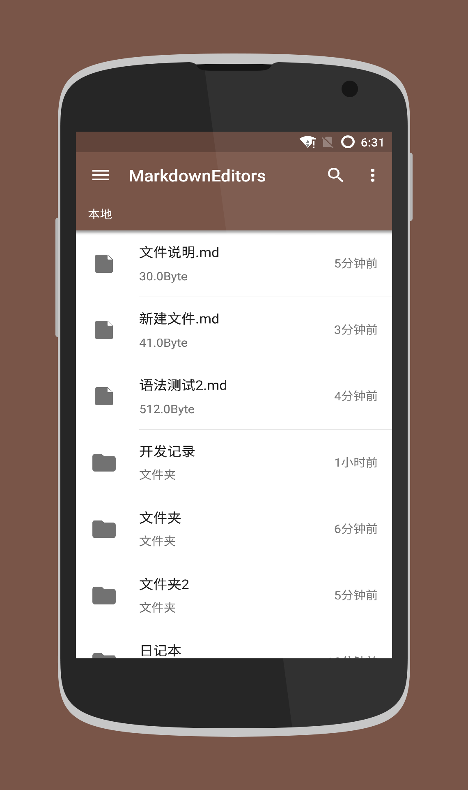
 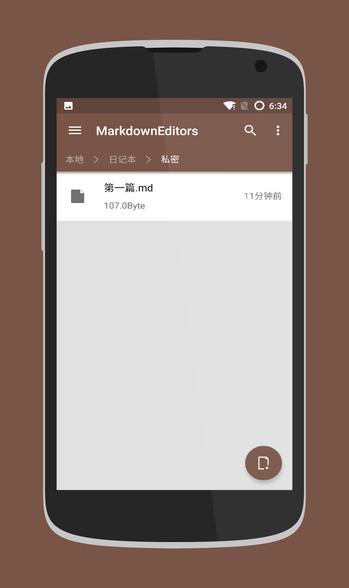
* 文件夹为空
 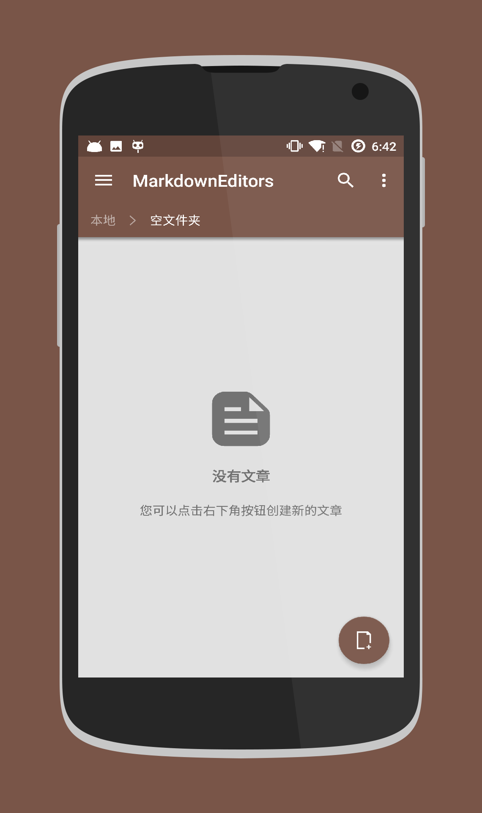
* 长按选择一个
 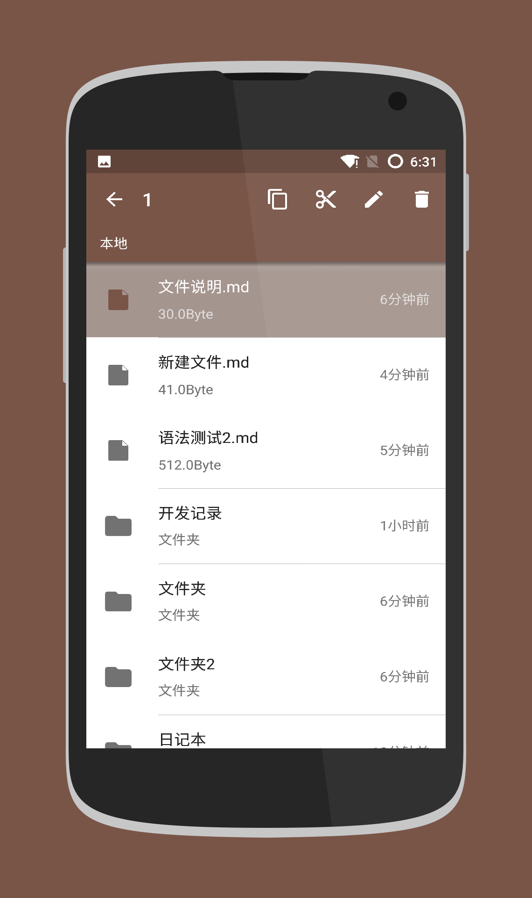
* 长按选择多个
 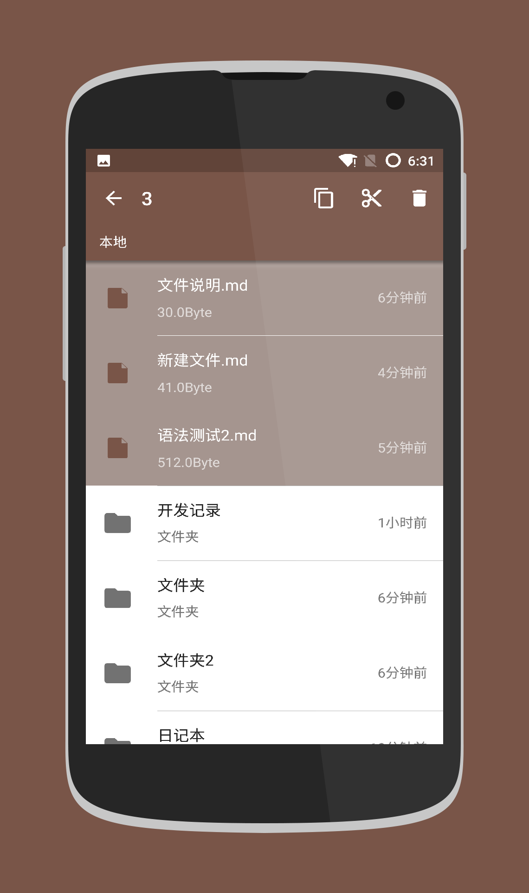
* 选择复制或者粘贴后
 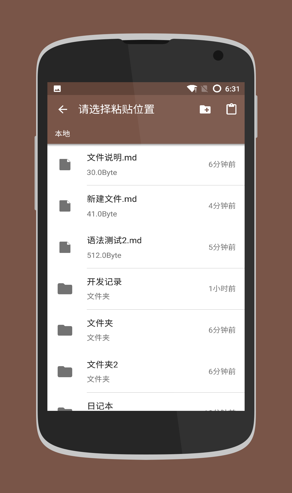
* 选择单个可以进行重命名
 
* 批量删除
 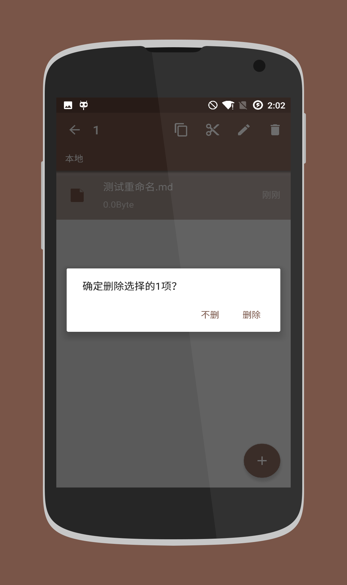
* 搜索当前文件夹
 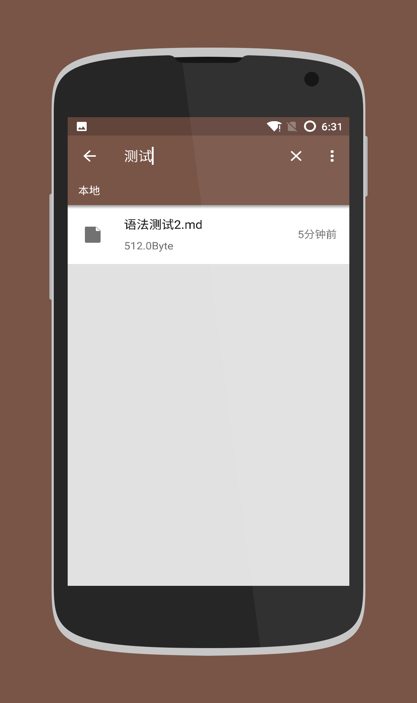
* 支持横屏
 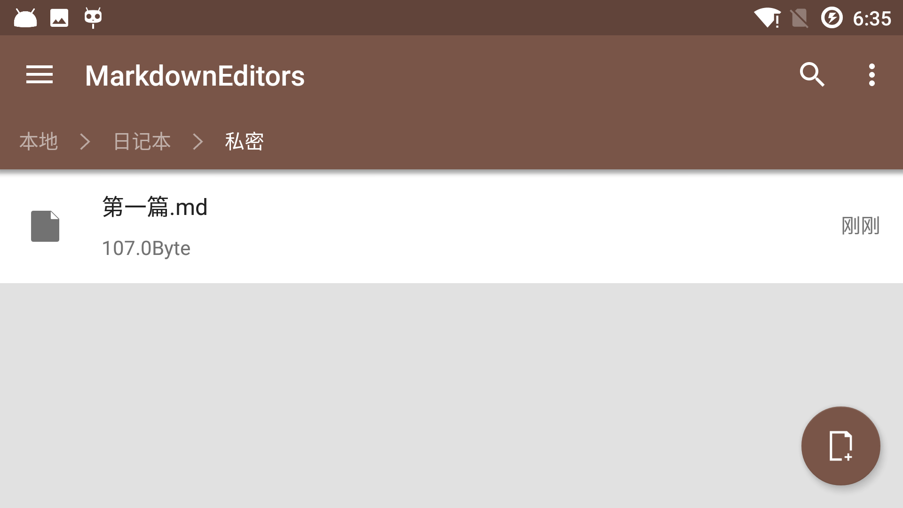
* 菜单
 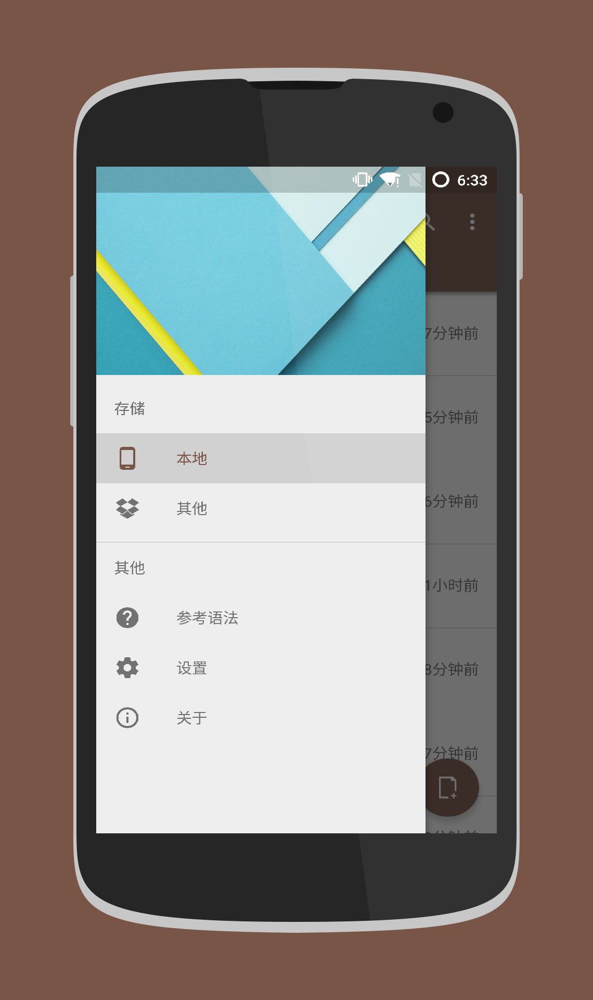
* 编辑界面
 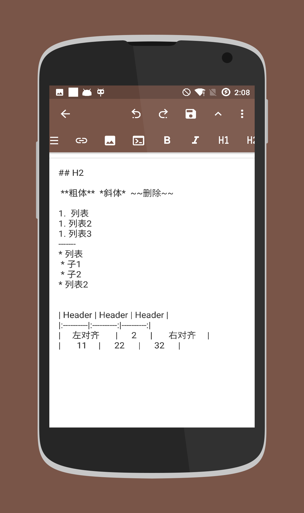
* 编辑界面隐藏快捷操作
 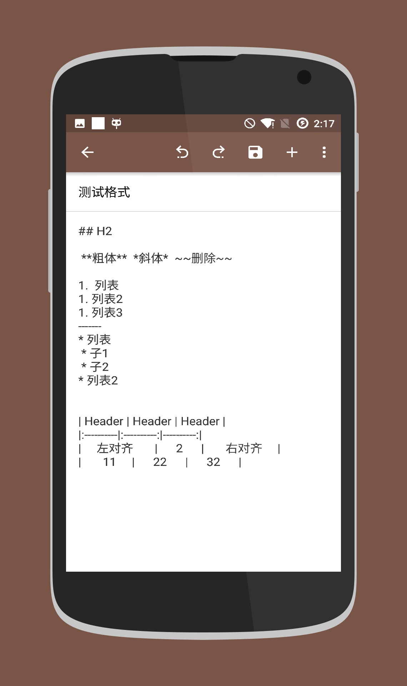
* 预览界面
 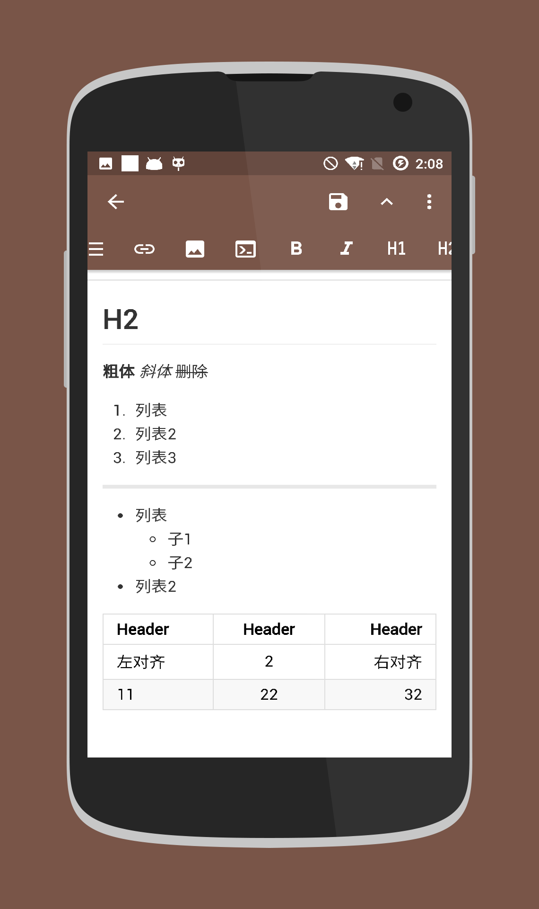
* 横屏
 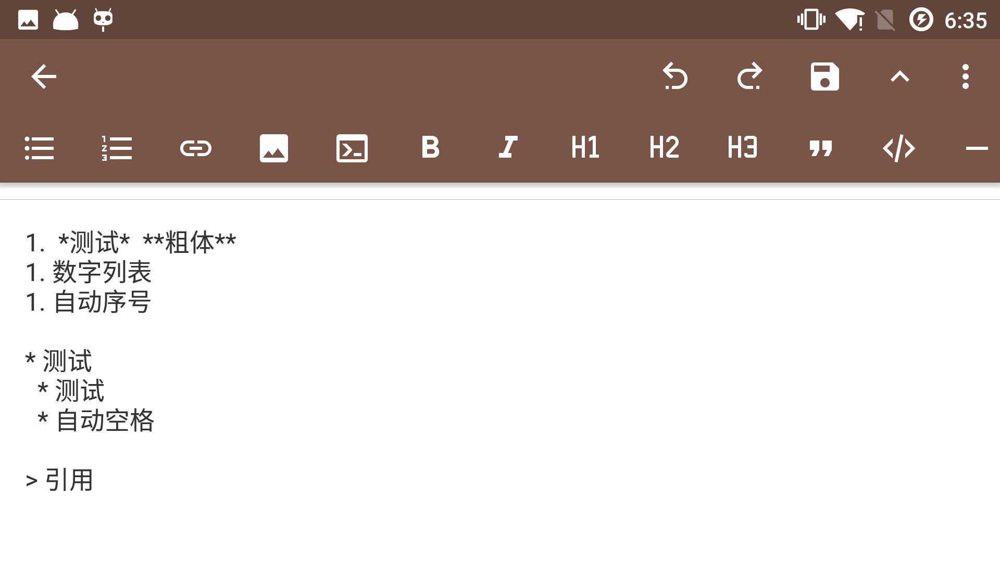
 

#### 动态图


---

