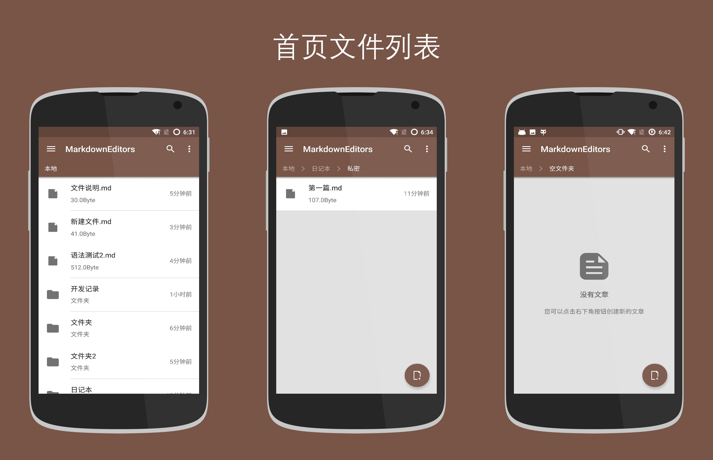
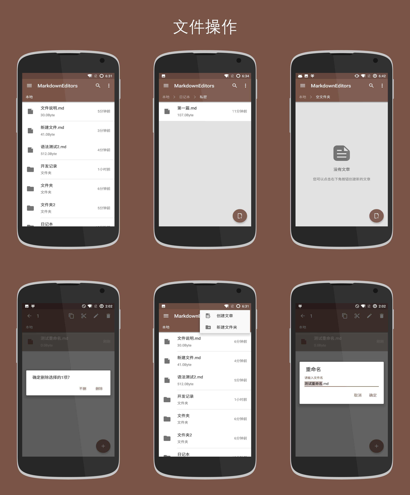
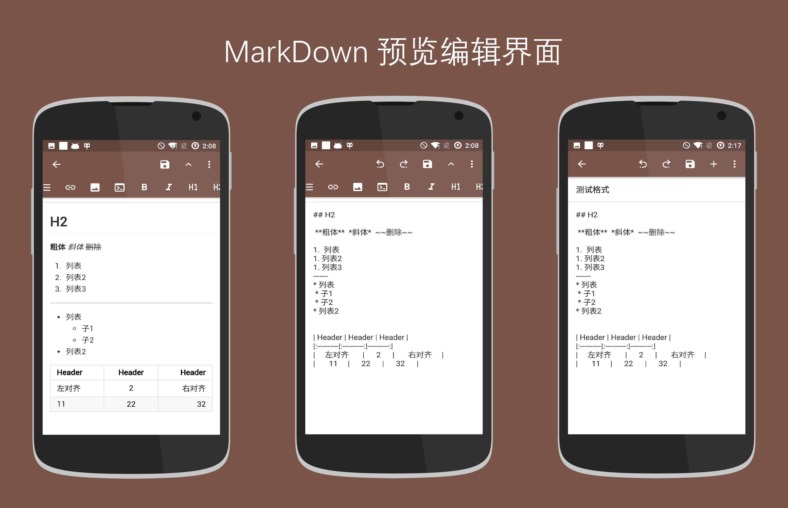
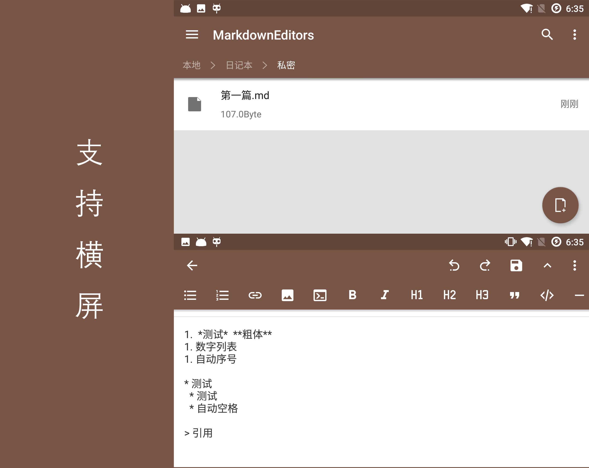
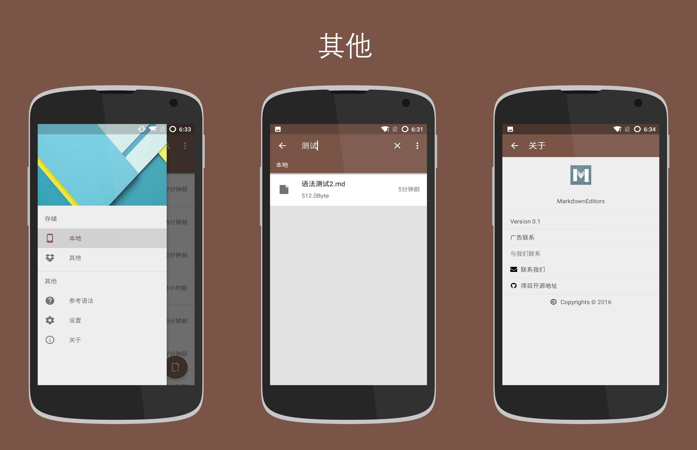

## MarkdownEditors

[91市场下载地址](http://apk.91.com/Soft/Android/ren.qinc.markdowneditors-1-0.1.html)

[百度应用下载地址](http://shouji.baidu.com/software/9609110.html)

[应用宝市场下载地址](http://android.app.qq.com/myapp/detail.htm?apkName=ren.qinc.markdowneditors)

[安卓市场下载地址](http://apk.hiapk.com/appinfo/ren.qinc.markdowneditors/1)

[小米应用商店下载地址](http://app.mi.com/detail/422745)

~~[应用下载](http://fir.im/mde)~~

基于Android的Markdown编辑器

> 第一个版本，可能存在bug，欢迎指正

> 功能本身不难，但是细节很多

> 部分界面和功能仿未开源的MarkdownX软件

其他
---
用了MVP+Rxjava

使用的开源库
---
* glide
* rxjava
* butterknife
* numberprogressbar
* kprogresshud
* android-bottom-sheet
* marked
* FlycoSystemBar
* ExpandableLayout
* 编辑中的撤销和恢复已经提取为单独的库[AndroidEdit] (https://github.com/qinci/AndroidEdit)

感谢
---
感谢默默为开源不遗余力做出努力的小伙伴，本项目是站在巨人的肩膀上。

**欢迎star、fork**

未完成的功能（后续版本要完成的功能）
---

* 分享
	* 分享为HTML
	* 分享为长图片
* 相关设置
* 其他远程存储方式
* 其他界面细节

已完成功能的截图
---

 

#### 动态图

历史版本
---
[v0.1](https://github.com/qinci/MarkdownEditors/tree/v0.1)

